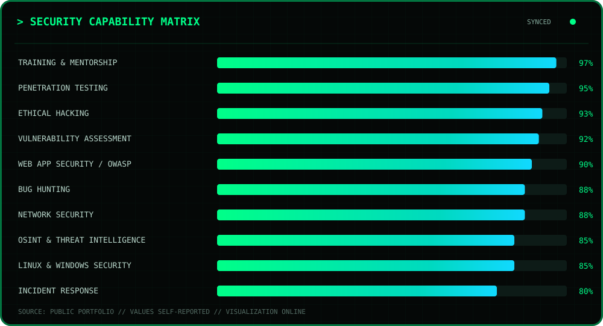

<div align="center">

<!-- ACCESS GRANTED // AUTHORIZED PROFILE SESSION -->


<br />


<br /><br />

[](https://sachinthilak.online)
[](https://skoolic.com)
[](mailto:thilaksachin0@gmail.com)
[](https://github.com/sachineo)

</div>

---

<div align="center">

## `> IDENTITY VERIFICATION`


<sub>The portrait above uses Sachin's supplied image as the unchanged identity source. Animation is applied to the surrounding HUD and scanner layers.</sub>

</div>

## `> LIVE METRIC HUD`

<div align="center">


</div>

## `> WHOAMI`

```console
sachin@kali:~$ whoami
Sachin T

sachin@kali:~$ cat identity.conf
ROLE="Cybersecurity Trainer & Mentor | Ethical Hacker | Security Researcher"
EDUCATION="Master of Computer Applications — Cybersecurity Specialization"
LOCATION="Coimbatore, India"
MISSION="Secure • Educate • Research • Build"

sachin@kali:~$ status
ONLINE — focused on authorized testing, responsible disclosure, and practical security education.
```

I am an MCA Cybersecurity graduate, instructor, ethical hacker, penetration tester, and independent security researcher based in Coimbatore, India. My work spans cybersecurity education, vulnerability research, web application security, network security, OSINT, VAPT, and responsible security testing.

I founded **Skoolic** to build practical cybersecurity learning experiences through structured courses, workshops, webinars, labs, and community-driven education.

<div align="center">
  
</div>

## `> SECURITY ARSENAL`

| Module | Authorized toolkit and focus |
|:--|:--|
| **Offensive Security** | Burp Suite · Metasploit · Nmap · Nessus · Kali Linux |
| **Network Analysis** | Wireshark · Nmap · traffic analysis · network auditing |
| **Security Areas** | Web Application Security · OWASP · Penetration Testing · Vulnerability Assessment · Network Security · OSINT · Threat Intelligence · Incident Response · Security Auditing |
| **Infrastructure / Cloud** | AWS · IAM · S3 · KMS · Linux · Windows Security |
| **Development / Automation** | Python · security automation · OSINT reconnaissance tooling |

<div align="center">


</div>

## `> CAPABILITY MATRIX`

<div align="center">
  
</div>

## `> GITHUB INTELLIGENCE`

<div align="center">


<br />


</div>

## `> CONTRIBUTION SNAKE`

<div align="center">
  <picture>
    <source media="(prefers-color-scheme: dark)" srcset="https://raw.githubusercontent.com/sachineo/sachineo/output/github-contribution-grid-snake-dark.svg" />
    <source media="(prefers-color-scheme: light)" srcset="https://raw.githubusercontent.com/sachineo/sachineo/output/github-contribution-grid-snake.svg" />
    
  </picture>
</div>

## `> CLASSIFIED PROJECT ARCHIVE`

### [BountyScope Ultimate](https://github.com/sachineo/bountyscope-ultimate)

Cyberpunk, local-first offensive security operations console for authorized research. It connects project scope, endpoint mapping, testing labs, evidence, findings, and reporting in one Electron workspace.

[](https://sachineo.github.io/bountyscope-ultimate/)
[](https://github.com/sachineo/bountyscope-ultimate)

### [BreachRadar X — Phone Exposure Lab](https://github.com/sachineo/breachradar-x-phone-exposure-lab)

Privacy-safe phone exposure intelligence lab for defensive cybersecurity awareness and controlled demonstrations.

### [Phishing Awareness Simulator](https://github.com/sachineo/phishing-awareness-simulator)

Safe cyberpunk phishing-awareness simulator with local detection and IOC case tracking for security education.

### Skoolic — Cybersecurity Platform

Founded and built a cybersecurity learning platform with structured courses, webinars, hands-on labs, and community training for learners across India.

### OSINT Threat Intelligence Tool

Python-based automation that aggregates public digital-footprint information for controlled OSINT training and research.

### Wireshark Traffic Analysis Lab

Advanced network-analysis labs focused on traffic inspection and malware-detection fundamentals.

### CTF Challenge Series

Cybersecurity exercises spanning web exploitation, reverse engineering, and cryptography for practical community learning.

## `> SECURITY CLEARANCES // CERTIFICATIONS`

| Credential | Issuer | Track |
|:--|:--|:--|
| Certified Ethical Hacker | EC-Council | CEH v10 |
| Offensive Security Web Expert | Offensive Security | OSWE |
| ISO/IEC 27001:2022 | Information Security | ISO Associate |
| Web Penetration Tester | Mile2 | WPT |
| Network Security Expert | Fortinet | NSE 1 & 2 |
| Cybersecurity Capstone | IBM | IBM Certified |
| Operating System Security | IBM | IBM Certified |
| Wireshark Network Analyst | Wireshark Foundation | Analyst |
| Data Encryption / AWS KMS | UST Global / AWS | AWS |

<sub>Credentials are presented as published on the public portfolio; this section does not independently assert current status.</sub>

## `> OPERATION HISTORY`

| Timeline | Operation | Focus |
|:--|:--|:--|
| **2024–Present** | **Founder & CEO — Skoolic** | Cybersecurity education, course development, workshops, webinars, and community training |
| **2022–2025** | **Lead Cybersecurity Instructor — Adaovi** | Ethical hacking, cryptography, network security, incident response, lab design, and mentorship |
| **2021–Present** | **Independent Security Researcher** | Authorized web and network pentesting, vulnerability assessment, security reporting, and remediation guidance |

## `> LIVE SYSTEM STATUS`

<div align="center">
  
</div>

## `> CURRENT MISSION // SKOOLIC`

Founder of **Skoolic** — building practical cybersecurity learning experiences for beginners and professionals through structured courses, webinars, labs, mentorship, and community education.

<div align="center">

[](https://skoolic.com)
[](https://sachinthilak.online)

</div>

## `> ESTABLISH SECURE CONNECTION`

<div align="center">

[](https://sachinthilak.online)
[](https://github.com/sachineo)
[](https://www.instagram.com/i_can_hack__you/)
[](mailto:thilaksachin0@gmail.com)

</div>

<div align="center">
  
</div>

> All security work represented here is intended for systems owned by the researcher or covered by explicit authorization. Responsible disclosure, privacy, and scope come first.

<br />

<div align="center">
  
</div>
