

<!-- ACCESS GRANTED // AUTHORIZED PROFILE SESSION -->

 


  

  


 


 


 


 

 

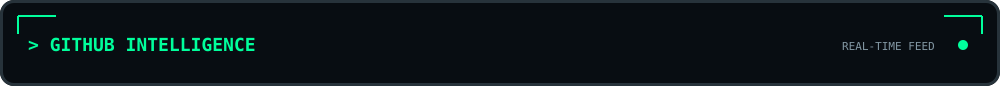

 

 

 

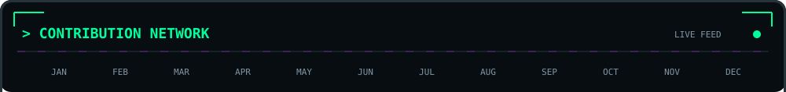
<picture>
  <source media="(prefers-color-scheme: dark)" srcset="https://raw.githubusercontent.com/sachineo/sachineo/output/github-contribution-grid-snake-dark.svg?v=2" />
  <source media="(prefers-color-scheme: light)" srcset="https://raw.githubusercontent.com/sachineo/sachineo/output/github-contribution-grid-snake.svg?v=2" />
  
</picture>
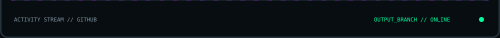

 


 

  


 


 


 


 

  

  


 


